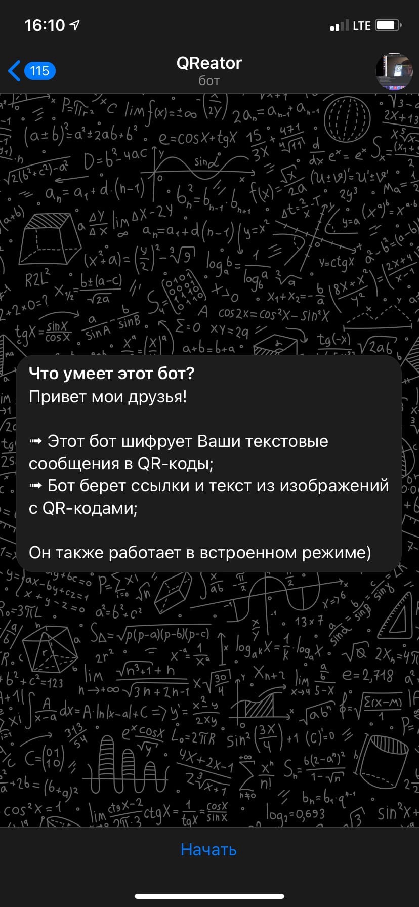
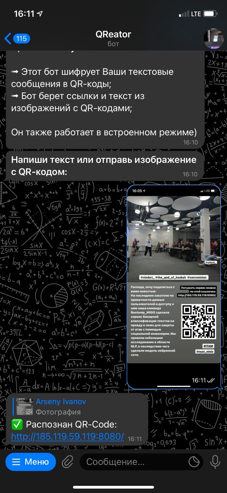
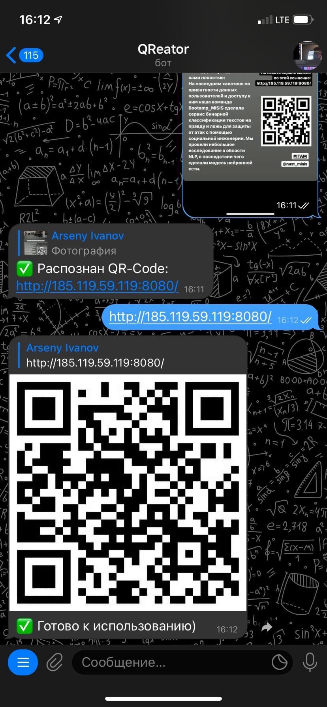
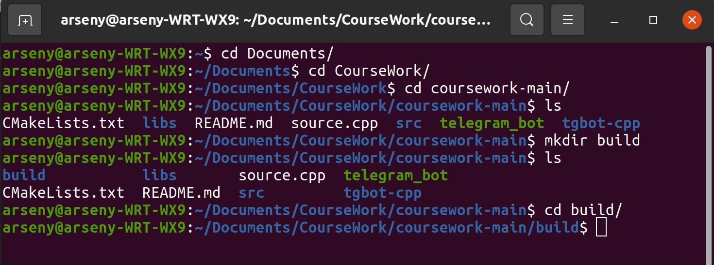

# Telegram-бот QReator на С++ для генерации и считывания QR-кодов

Проект выполнен совместно с <https://github.com/atokagzx>

Данный Telegram-bot позволяет взаимодействовать с
штрих-кодами разных типов. Telegram-бот предназначен для генерации и детекции
матричных штриховых кодов без использования программ для обработки изображений и
наличия специальных навыков для этого. С помощью данного бота пользователь может
распознавать на картинке/скриншоте штрих коды, а также генерировать новые QR-коды
по определенному тексту/ссылке/номеру телефона в удобном Telegram-боте с user-friendly
интерфейсом. Результатом служит сгенерированный QR-код или информация с
распознанных на изображении штрих-кодов.

Приветственное окно        |  Команда /start           | Детекция QR-кода    |  Генерация QR-кода
:-------------------------:|:-------------------------:|:-------------------------:|:-------------------------:
  |    |    |  

Для детекции бот может принимать на вход изображения с
расширением .jpeg .jpg .png .svg. Для генерации бот принимает на вход текст и
преобразует его в QR-код с расширением .jpeg в 4 размерах: 300x300, 40x40, 1080x1080,
1024x1024 – в пикселях.

<b>Детекция штрих-кодов:</b><br>
При обнаружении знака бот отправит сообщение с расшифрованной
информацией, а также напишет, какого конкретно типа данный штрих-код.
Поддерживаются линейные и двумерные: UPC/EAN-128; EAN-13; UPC-E;
Code39; UPC-A; EAN-8; «Interleaved 2of5»; QR-codes

<b>Генерация штрих-кода:</b><br>
Генерируются только QR-коды (поскольку это самый распространённый вид
штрих кодов и используется в 95% случаев) и происходит это по введенному
тексту пользователя. Во время компиляции проекта внутри директории
~/Documents/CourseWork/coursework-main/build создается буферное
изображение example1.jpeg, которое обновляется на новый QR-код при
каждом запросе на генерацию и после чего выводится пользователю.

# Сборка проекта
<b>1) Установка OpenCV</b><br>
Для работы программы понадобятся дополнительные библиотеки и утилиты. Для 
обработки изображений использовалась библиотека OpenCV. Чтобы решение заработало, 
надо скачать эту библиотеку с официального сайта https :// opencv. org под язык C++. Проще
всего вести установку в терминале Ubuntu. Процесс установки ограничивается 5 этапами: 
1. Обновление Ubuntu
2. Установка зависимостей
3. Скачивание OpenCV с официальных репозиториев на GitHub
```
/opt$ git clone https://github.com/Itseez/opencv.git
/opt$ git clone https://github.com/Itseez/opencv_contrib.git
```
4. Сборка и установка OpenCV.
```
/opt/opencv/release$ cmake -D BUILD_TIFF=ON -D WITH_CUDA=OFF -D ENABLE_AVX=OFF -
D WITH_OPENGL=OFF -D WITH_OPENCL=OFF -D WITH_IPP=OFF -D WITH_TBB=ON -D 
BUILD_TBB=ON -D WITH_EIGEN=OFF -D WITH_V4L=OFF -D WITH_VTK=OFF -D 
BUILD_TESTS=OFF -D BUILD_PERF_TESTS=OFF -D CMAKE_BUILD_TYPE=RELEASE -D 
CMAKE_INSTALL_PREFIX=/usr/local -D 
OPENCV_EXTRA_MODULES_PATH=/opt/opencv_contrib/modules /opt/opencv/
```
5. Проверка успешности установки OpenCV на ПК путем написания команды 
```
$ pkg-config --modversion opencv
3.2.x
```
В случае, если возвращаемым результатом будет версия OpenCV, то установка прошла 
<b>успешно</b>.

<b>2) Установка tgbot-cpp</b><br>
Для работы с Telegram использовалась библиотека tgbot-cpp – библиотека С++14
для работы с Telegram bot API. Во-первых, вам нужно установить некоторые зависимости,
13 такие как Boost, и инструменты сборки, такие как CMake, если их нет. 
В дистрибутивах на базе Ubuntu это можно сделать с помощью:
```
$ sudo apt-get install g++ make binutils cmake libssl-dev libboost-system-dev 
zlib1g-dev
```

```
$ git clone https://github.com/reo7sp/tgbot-cpp 
$ cd tgbot-cpp 
$ cmake . 
$ make -j4 
$ sudo make install
```

<b>3) Установка ZBAR</b><br>
Для работы с штрих кодами использовалась библиотека ZBAR. Для того, чтобы ее
подключить достаточно прописать в терминале:
```
$ sudo apt install zbar-tools
```

<b>4) Сборка и инсталлирование проекта</b><br>
После установки OpenCV, tg-bot, ZBAR и добавления QR-Code-Generator и tinypngout
можно переходить к сборке программы с помощью CMake. Необходимо
создать директорию, в которой в последствии будет билдиться проект - ../build



После чего необходимо прописать в терминале:
```
cmake ..
make
src/echobot
```


